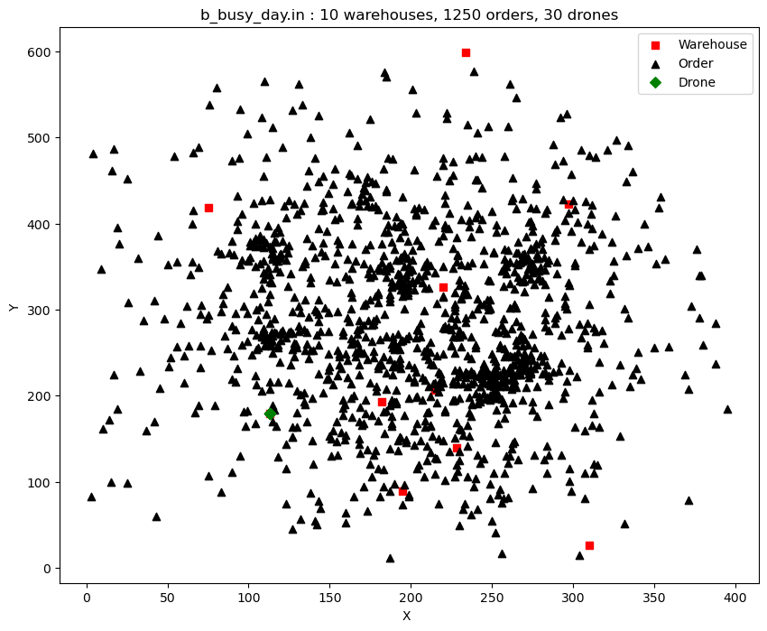
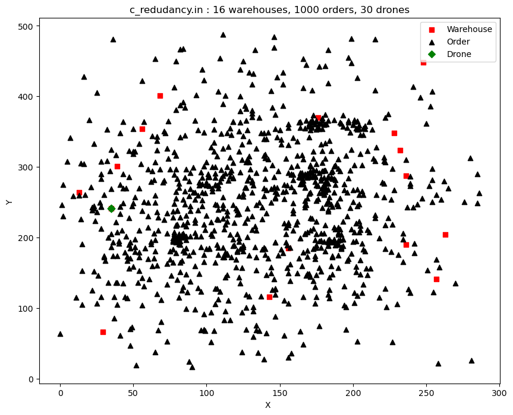
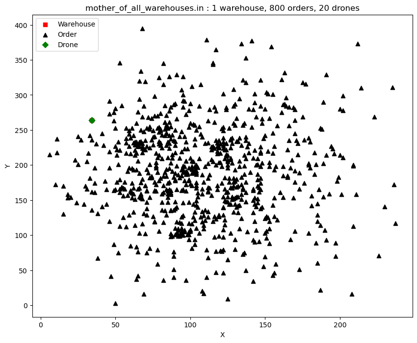

Projet Poly#
============

## A-Création des classes

## B-Extraction des données

## C-Analyse des données

Pour chaque fichier dans /challenges, on va :

### 1-Réprésenter les données (warehouses, orders, drones) sur un plan orthonormé

Pour ce faire, on s'est servi des bibliothèques `numpy` et `matplotlib`. 

Il faut noter qu'initialement les **drones** se trouvent au **warehouse 0**. Ce qui fait que le premier warehouse est 
masqué par le losange vert.

__fichier : b_busy_day.in__

__fichier : c_redudancy.in__

__fichier : mother_of_all_warehouses.in__

### 2- Analyse statistique des données

| Fichier                        | Moyenne du poids d'un type de produit | max_payload/moyenne_poids_type_produit | Dans une commande, en moyenne le nombre d'articles |
| :----------------------------: |:-------------------------------------:| :-------------------------------------:|-------------------------------------------------------------|
| b_busy_day.in                  |   64.5875                             |  3.09                                  | 7.4944                                                       |
| c_redudancy.in                 |   63.6525                             |   3.14                                 | 7.444                                                       |
| d_mother_of_all_warehouses.in  |   63.816                              |    3.13                                | 7.72125                                                     |

### 3- Que nous inspire de cette analyse

Il faudrait mieux :

1- Boucler sur une **order** que sur une **warehouse**

2- Pour une **order** mettre à ses services tous les **drones**

3- Trier les **orders** par nombre d'articles uniquement sur ce critère. Et si les **orders** ont même nombre d'articles, trier par poids de l'**order** sinon encore par diversité des types de produits. Dans un ordre croissant.

Le fichier `README.md` est écrit en [**Markdown**](https://docs.github.com/en/get-started/writing-on-github/getting-started-with-writing-and-formatting-on-github/basic-writing-and-formatting-syntax) et permet de soigner la _mise en forme_.

Fonctionnement du projet
========================

Description du fonctionnement du projet, notamment comment le lancer (paramètres, etc).

La syntaxe générale/minimale est

    polyhash.py ./challenges/challenge.in ./output/sortie.txt

L'équipe
========

À compléter par chaque personne: 1 ligne par personne, indiquant le nom et l'adresse mail de la personne (et vous pouvez supprimer cette ligne ensuite). L'objectif dans le premier TP est de provoquer des conflits d'édition, qui surviennent quand un même fichier est modifié au même endroit par plusieurs personnes.

- Seynabou Faye; seynabou.faye@etu.univ-nantes.fr
- Younes Hammoutene; younes.hammoutene@etu.univ-nantes.fr
- Sirine Dakhli sirine.dakhli@etu.univ-nantes.fr
- Souaibou Dine Barry souaibou-dine.barry@etu.univ-nantes.fr 
