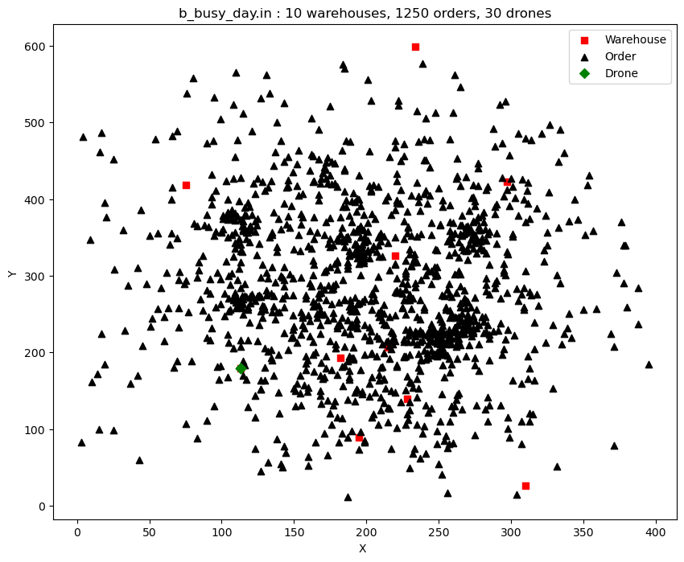
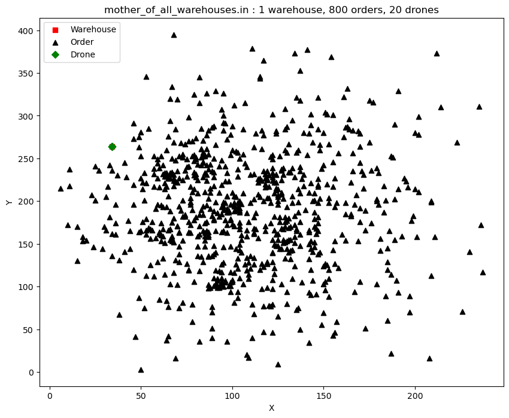

# Fonctionnement du projet

Pour exécuter le projet, utilisez le script `polyhash.py`. Voici un exemple de commande :

```bash
python polyhash.py ./challenges/a_example.in
```

# Projet PolyHash

Le Projet PolyHash se concentre sur le développement d'un système de gestion de livraison, utilisant des drones pour l'acheminement des commandes. Le projet est structuré à l'aide de quatre fichiers clés. Les fichiers inclus sont les suivants :

1. **`classes.py` :** Ce fichier contient les définitions des classes essentielles qui forment le squelette du système. Les classes telles que Simulation, Drone, Warehouse, Order et ProductType sont implémentées ici, chacune jouant un rôle crucial dans la simulation du processus de livraison.

2. **`polyparser.py` :** Ce module est dédié à l'extraction des données nécessaires à la simulation à partir des fichiers d'entrée. La fonction principale ,parse_challenge(), de ce fichier est de lire et interpréter les informations relatives aux entrepôts, aux commandes, aux drones et autres paramètres essentiels.

3. **`polysolver.py` :** Le fichier principal de l'algorithme de simulation. C'est ici que la logique du déroulement de la livraison est implémentée. La fonction principal ,solve(), permet pour chaque commande : la recherche du warehouse le plus proche, du drone le plus approprié, le chargement optimal, la livraison et d'autres étapes cruciales sont définies dans cet algorithme.

4. **`polyhash.py` :** Ce fichier permet de finaliser tout le code. Il contient la fonction main et la logique de l'optimisation du challenge en fonction du fichier d'entrée. L'utilisation d'une approche de var_optimize ajustée en fonction du fichier d'entrée montre l'adaptabilité du système à différents scénarios de livraison.

L'organisation en quatre fichiers distincts vise à assurer une séparation claire des responsabilités et à faciliter la maintenance et l'extension du système. La combinaison de ces fichiers offre une solution complète pour le défi complexe de la gestion de livraison par drones.

## A. Création des classes

Le projet PolyHash implémente une simulation de livraison utilisant différentes classes pour représenter les entités du problème :
-Les classes nécessaires pour la simulation sont définies dans le fichier `classes.py`.
-Elles incluent les classes `Simulation`, `Drone`, `Warehouse`, `Order`, et `ProductType`.
-Nous avons implementer dans chaque classes des méthodes et des fonctions.

### Classes Implémentées

1. **Simulation (`Simulation`):**
   - Représente la simulation dans son ensemble.
   - Attributs : `rows`, `columns`, `drones`, `turns`, `max_payload`, `product_types`, `warehouses`, `orders`, `score`.
   - Méthodes : `sort_orders()` pour trier les commandes.

2. **Drone (`Drone`):**
   - Représente un drone dans la simulation.
   - Attributs : `drone_id`, `location`, `payload`, `current_turn`, `inventory`, `is_free`.
   - Méthodes : `update_is_free()`: méthode pour mettre à jour le statut du drone, 
                `load()`: méthode pour charger le drone, 
                `deliver()`: méthode pour décharger le drone afin de livrer la commande .

3. **Warehouse (`Warehouse`):**
   - Représente un entrepôt.
   - Attributs : `warehouse_id`, `location`, `inventory`.
   - Méthodes : `update_is_empty()`: méthode pour mettre à jour le statut de l'entrepôt.

4. **Order (`Order`):**
   - Représente une commande à livrer.
   - Attributs : `order_id`, `location`, `inventory`, `order_turns`, `is_completed`.
   - Méthodes : `update_is_completed()`: méthode pour mettre à jour le statut de la commande .

5. **ProductType (`ProductType`):**
   - Représente un type de produit.
   - Attributs : `product_type_id`, `weight`.

## B. Analyse des données

Avant de commencer l'implémentation de la solution , on s'est d'abord orienté vers l'analyse des données qui nous a été fournis

1. **Représentation des données sur un plan orthonormé :**
   -Pour chaque fichier dans le répertoire `/challenges`, les données sont représentées graphiquement sur un plan orthonormé.

   - `b_busy_day.in`

   

   - `c_redudancy.in`

   

   - `mother_of_all_warehouses.in`
   
   

2. **Analyse statistique des données :**
   - Moyenne du poids d'un type de produit
   - max_payload/moyenne_poids_type_produit
   - Dans une commande, en moyenne le nombre d'articles

   | Fichier                      | Moyenne Poids Type Produit | Max Payload / Moyenne Poids Type Produit | Moyenne Articles par Commande |
   | -----------------------------|--------------------------- | ---------------------------------------- | ------------------------------ |
   | b_busy_day.in                | 64.5875                   | 3.09                                   | 7.4944                       |
   | c_redudancy.in               | 63.6525                   | 3.14                                   | 7.444                        |
   | d_mother_of_all_warehouses.in| 63.816                    | 3.13                                   | 7.72125                      |

3. **Que nous inspire cette analyse :**

      1. **Stratégie de Livraison :**
    - Plutôt que de boucler sur un entrepôt, il est plus efficace de se concentrer sur chaque commande individuellement.
    - Pour une commande donnée, mobiliser tous les drones disponibles afin d'accélérer le processus de livraison.
      2. **Priorisation des Commandes :**
    - Les commandes devraient être triées en priorité par le nombre d'articles qu'elles contiennent.
    - En cas d'égalité du nombre d'articles entre plusieurs commandes, prioriser celles ayant un poids plus élevé.
    - Si des commandes ont à la fois le même nombre d'articles et le même poids, alors les trier en fonction de la diversité des types de produits.

    Ces ajustements visent à optimiser la séquence d'exécution des commandes et à maximiser l'efficacité des drones dans la livraison.

## C. Extraction des données

-Les données d'entrée sont extraites à l'aide du fichier `polyparser.py`, qui contient la fonction `parse_challenge()`.
-Cette fonction permet d'extraire les paramètres essentiels, tels que le nombre de lignes, de colonnes, de drones, etc.....
-Les types de produits et leurs poids associés sont extraits pour créer une liste d'objets 'ProductType'.
-Les informations sur les entrepôts, y compris leur emplacement et inventaire, sont extraites pour instancier des objets 'Warehouse'.
-Les détails sur les commandes, incluant emplacement et inventaire, sont extraits pour créer des objets 'Order'.
-Une liste de drones est créée, initialement positionnée au premier entrepôt.
-Cette fonction lit le fichier d'entrée et crée une instance de la classe `Simulation` en utilisant les classes définies dans `classes.py`.

## D. Algorithme

Le déroulement de notre simulation se passe dans le fichier `polysolver.py` via la fonction `solve()`, et suit les étapes suivantes :
 Pour chaque commande `o` parmi les commandes triées :
   - Rechercher l'entrepôt `w` le plus proche de la commande `o` qui contient au moins un article de la commande.
   - Rechercher le drone `d` le plus proche (forcément non vide) de l'entrepôt `w`.
   - Déplacer le drone `d` vers l'entrepôt `w`.
   - Charger le drone `d` en commençant par un type de produit, prenant le minimum entre la quantité disponible dans l'entrepôt `w` et celle dans le drone `d`. Si le chargement est impossible, décrémenter de 1 jusqu'à 0, puis passer au type de produit suivant.
   - Déplacer le drone `d` vers la commande `o`.
   - Livrer les articles dans l'inventaire du drone `d` à la commande `o`.
   - Si la commande est complétée, passer à la suivante. Sinon, reprendre le processus jusqu'à ce qu'elle soit complète.

## Fonctionnement du projet

Pour exécuter le projet, utilisez le script `polyhash.py`. Voici un exemple de commande :

```bash
python polyhash.py ./challenges/challenge.in
```

L'équipe
========

Les membres de l'équipe CIDIA, qui ont fourni ces livrables sont : 

- Souaibou Dine Barry; souaibou-dine.barry@etu.univ-nantes.fr 
- Seynabou Faye; seynabou.faye@etu.univ-nantes.fr
- Younes Hammoutene; younes.hammoutene@etu.univ-nantes.fr
- Sirine Dakhli sirine.dakhli@etu.univ-nantes.fr

